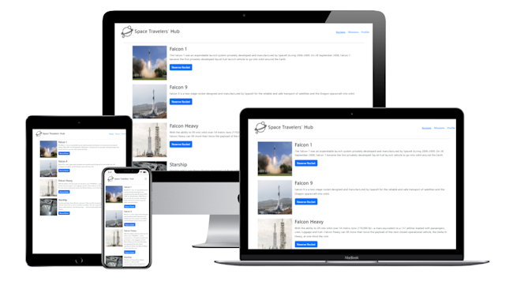

<a name="readme-top"></a>

<div align="center">

  <h3><b>Space X</b></b></h3>
  

</div>

# 📗 Table of Contents

- [📖 Space X ](#-space-x-)
  - [🛠 Built With ](#-built-with-)
    - [Tech Stack ](#tech-stack-)
    - [Key Features ](#key-features-)
    - [Prerequisites](#prerequisites)
    - [Setup](#setup)
    - [Install](#install)
    - [Usage](#usage)
    - [Run tests](#run-tests)
    - [Deployment](#deployment)
  - [👥 Author ](#-author-)
  - [🔭 Future Features ](#-future-features-)
  - [🤝 Contributing ](#-contributing-)
  - [⭐️ Show your support ](#️-show-your-support-)
  - [🙏 Acknowledgments ](#-acknowledgments-)
  - [📝 License ](#-license-)

<!-- PROJECT DESCRIPTION -->

# 📖 Space X <a name="about-project"></a>

The Space X app is a project assignment of module three where we are required to build our Group Capstone Project React. We use Axios to make calls to a rockets API endpoint, and a missions API endpoint to fetch data, we also use Redux( useSelector and useDispatch) to update the state by reserving and cancelling missions and booking and cancelling rockets. We can navigate between pages using React router, and fetch data with useEffect, finally, we used Jest and React Testing Library to make component tests and mock API calls.

## 🛠 Built With <a name="built-with"></a>

### Tech Stack <a name="tech-stack"></a>


<!-- Features -->

### Key Features <a name="key-features"></a>

- Routing using react router.
- App wide State Management with Redux.
- Styling with Tailwind css

<p align="right">(<a href="#readme-top">back to top</a>)</p>

<!-- LIVE DEMO -->

### Live Demo <a name = "live-demo"></a>

### Prerequisites

In order to run this project you need to have the following installed:

```sh
- A web browser
- A code editor
- A terminal
- Git
- Node.js
```

### Setup

Clone this repository to your desired folder:

```sh
  cd my-folder run `git clone https://github.com/lincoln1883/anancy-bookstore/`
```

### Install

Install this project with:

```sh
  cd my-folder run `npm install`
```

### Usage

To run the project, execute the following command:

open the index.html file in your browser using the live server extension.

### Run tests

To test please execute the following command:

```sh
    run `npm test`
```

<p align="right">(<a href="#readme-top">back to top</a>)</p>

<!-- AUTHORS -->

## 👥 Author <a name="authors"></a>

####👤 Lincoln Gibson

- GitHub: [lincoln1883](https://github.com/lincoln1883)
- Twitter: [lincolngibson7](https://twitter.com/lincolngibson7)
- LinkedIn: [lincoln-gibson](https://linkedin.com/in/lincoln-gibson)

####👤 Marco Almada

- GitHub: [@MarcoDDM](https://github.com/MarcoDDM)
- Twitter: [@nerdpiola](https://twitter.com/nerdpiola)
- LinkedIn: [Marco Almada](https://www.linkedin.com/in/marcoalmadaar/)

<!-- FUTURE FEATURES -->

## 🔭 Future Features <a name="future-features"></a>

- Testing with Jest & React Testing Library.

<p align="right">(<a href="#readme-top">back to top</a>)</p>

<!-- CONTRIBUTING -->

## 🤝 Contributing <a name="contributing"></a>

Contributions, issues, and feature requests are welcome!

Feel free to check the [issues page](../../issues/).

<p align="right">(<a href="#readme-top">back to top</a>)</p>

<!-- SUPPORT -->

## ⭐️ Show your support <a name="support"></a>

- Give a ⭐️ if you like this project!

<p align="right">(<a href="#readme-top">back to top</a>)</p>

<!-- ACKNOWLEDGEMENTS -->

## 🙏 Acknowledgments <a name="acknowledgements"></a>

- Thank you Microverse.

<p align="right">(<a href="#readme-top">back to top</a>)</p>

<!-- LICENSE -->

## 📝 License <a name="license"></a>

This project is [MIT](./LICENSE) licensed.

<p align="right">(<a href="#readme-top">back to top</a>)</p>
